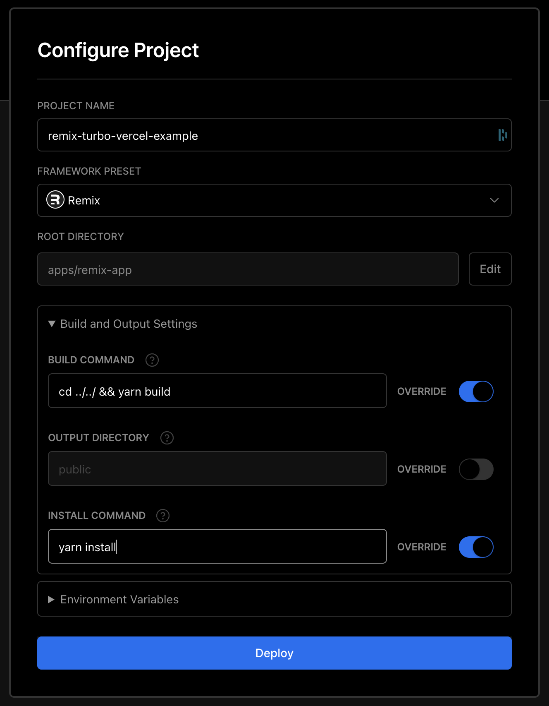

# Remix Turborepo Vercel

Example of setting up a Remix app that will be deployed to vercel from inside a Turborepo monorepo.

What makes this different from deploying a normal remix app to Vercel,
is that Vercel doesn't include files from the root `node_modules` when deploying the app.
In order to work around this, we take the server build output from `remix` and
bundle it using `rollup` so that all the necessary dependencies are present when deployed.

# Vercel config

In order for this to work, your Vercel config should look like this:

